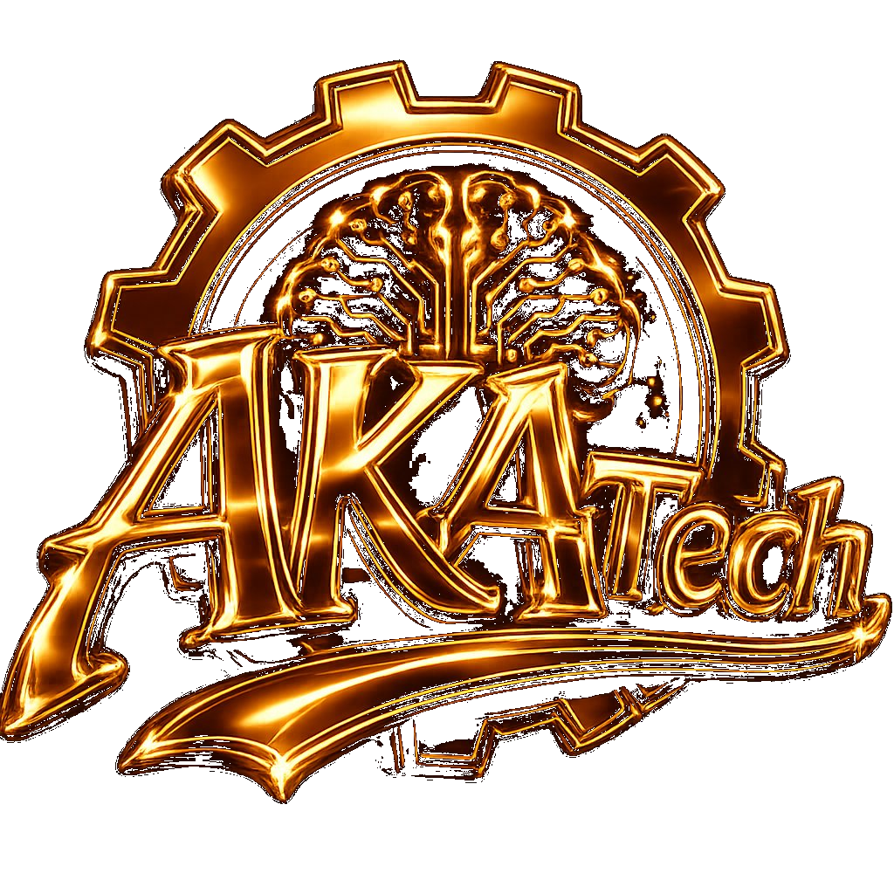

<div align="center">



# AKAFOLIO v3 — Elvis M'BOLLO

**Portfolio Full-Stack · React 18 · Three.js · GSAP**

[](https://akafolio160502.vercel.app/)
[](https://react.dev/)
[](https://vitejs.dev/)
[](LICENSE)
[]()

*Single Page Application · Neo-Brutalism × Glassmorphism · WebGL · Animations CSS natives*

</div>

---

## Aperçu

Portfolio personnel interactif présentant mes compétences, projets et expériences en développement web. Conçu avec React 18, un fond 3D WebGL (Three.js + GSAP ScrollTrigger), et un système d'animations CSS entièrement maison — sans librairie d'icônes externe.

**Design :**
- 🌙 Mode sombre (défaut) — orange vif `#FF5500` sur fond noir `#0A0A0A`
- ☀️ Mode clair — Neo-Brutalism éditorial avec ombres portées
- 🕐 Basculement automatique selon l'heure locale (sombre entre 18h et 6h)

---

## Stack technique

| Couche | Technologies |
|---|---|
| **Frontend** | React 18, Vite 5, Tailwind CSS 4 |
| **3D & Animation** | Three.js, GSAP + ScrollTrigger, Framer Motion |
| **Styles** | CSS custom (variables, animations natives), Space Mono, Unbounded |
| **Formulaire** | FormSubmit (AJAX, sans backend) |
| **Déploiement** | Vercel |

---

## Fonctionnalités clés

### 🌐 Background WebGL — `ScrollDepthScene`
Terrain wireframe animé + particules Three.js synchronisés au scroll via GSAP ScrollTrigger. Deux phases de zoom caméra, hero blast exit, entrées section staggerées.

### ✏️ ScrambleText
Décodage lettre par lettre au scroll (IntersectionObserver). Utilisé sur le nom dans le Hero, la tagline About et l'accroche Contact.

### 🃏 FanDeck 3D
Carousel glassmorphism 14 projets — état Stack → Fan → Focus, drag & swipe, navigation clavier `←→`, filtres pill par catégorie.

### 🎨 Carte AKATech générative
Rendu 100% CSS : aurora orbs, grille pulsante, scan line, logo glow — zéro image requise.

### 🔧 Système d'icônes `LI`
40+ icônes SVG animées injectées en CSS, sans dépendance externe (remplacement de lucide-react).

### 📱 Responsive complet
Breakpoints : `1024px · 768px · 480px`. Cartes Tarifs et Timeline en swipe mobile via `StackedCard`.

---

## Installation

```bash
git clone https://github.com/wthomasss06-stack/portfolio-akafolio.git
cd portfolio-akafolio
npm install
npm run dev        # http://localhost:5173
npm run build      # build production
npm run preview    # prévisualiser le build
```

> **Node.js ≥ 18** requis.

---

## Structure du projet

```
elvis-portfolio/
├── public/
│   ├── assets/
│   │   ├── images/projects/   # Aperçus des projets
│   │   └── CV_MBOLLO_AKA_ELVIS.pdf
│   └── demos/                 # Démos HTML standalone
├── src/
│   ├── App.jsx                # Composants + données (PROJECTS, SERVICES, PRICING…)
│   ├── Win95Portfolio.jsx     # Easter egg thème Windows 95
│   ├── style.css              # Variables CSS, animations, thèmes
│   └── components/
│       ├── ScrollDepthScene.jsx   # Background WebGL Three.js + GSAP
│       └── ScrambleText.jsx       # Décodage texte au scroll
├── index.html
├── vite.config.js
└── tailwind.config.js
```

---

## Services & Tarifs

> 💡 Tous les plans incluent un **nom de domaine offert (1 an)**. Hébergement inclus selon le plan.

### 🖥️ Portfolio personnel

| Plan | Prix | Délai |
|---|---|---|
| Starter | 70 000 FCFA | 3–5 jours |
| Pro | 120 000 FCFA | 5–7 jours |
| Elite | 180 000 FCFA | 7–10 jours |

### 🏢 Site Vitrine

| Plan | Prix | Délai |
|---|---|---|
| Starter | 150 000 FCFA | 5 jours |
| Pro ⭐ | 270 000 FCFA | 7–10 jours |
| Premium | 450 000 FCFA | 10–14 jours |

### 🛒 E-commerce

| Plan | Prix | Délai |
|---|---|---|
| Starter | 400 000 FCFA | 14 jours |
| Pro ⭐ | 650 000 FCFA | 21 jours |
| Scale | 1 000 000 FCFA | 30 jours |

### ⚙️ Application SaaS / Web App

| Plan | Prix | Délai |
|---|---|---|
| MVP | 700 000 FCFA | 3–4 semaines |
| Pro ⭐ | Sur devis | 4–6 semaines |
| Enterprise | À partir de 2 500 000 FCFA | 6–10 semaines |

### Ce que je propose

| # | Service |
|---|---|
| 01 | Applications Web (React, Next.js, Django, Flask) |
| 02 | API RESTful & intégrations backend |
| 03 | Interfaces responsives mobile-first |
| 04 | Conception & gestion de bases de données (MySQL) |
| 05 | Sécurité applicative |
| 06 | Support technique & maintenance |

---

## Projets en production

| Projet | Description | Stack | Lien |
|---|---|---|---|
| **AKATech** ⭐ | Agence digitale — site officiel | Next.js 15, Framer Motion, WebGL | [→](https://akatech.vercel.app/) |
| **ShopCI** | Marketplace multi-vendeurs | React, Django, Bootstrap | [→](https://shop-ci.vercel.app/) |
| **TechFlow** | Site vitrine professionnel | HTML, Tailwind, JS | [→](https://techflow-ten.vercel.app/) |
| **TerraSafe** | Plateforme foncière anti-arnaque | Flask, MySQL, Bootstrap | [→](https://wthomassss06.pythonanywhere.com) |
| **Tati** | Portfolio & vitrine double | React, Tailwind, Framer Motion | [→](https://tatii.vercel.app/) |
| **MK** | Portfolio graphiste sur-mesure | React, Tailwind, Framer Motion | [→](https://mory01ff.vercel.app/) |
| **ManoBeat 777** | Portfolio beatmaker | React, Tailwind, Howler.js | [→](https://xxx-x.vercel.app/) |
| **New Horizon Service** | Location de résidences meublées | Next.js, Flask, MySQL | [→](https://new-horizonservice.vercel.app/) |
| **Université les Anges** | Site institutionnel | HTML, CSS, Bulma | [→](https://universitelesanges.vercel.app/) |

> 4 démos fonctionnelles supplémentaires (Chap-chapMAP, ElvisMarket, MonCashJour, LivreurTrack Pro) accessibles via le portfolio.

---

## Variables CSS

```css
/* Thème sombre (défaut) */
:root {
  --ink:    #F0F0F0;
  --paper:  #0A0A0A;
  --acc:    #FF5500;   /* Orange signature */
  --border: #333333;
  --shadow: 4px 4px 0 #333;
  --fd: 'Unbounded', sans-serif;
  --fb: 'Space Mono', monospace;
}

/* Thème clair */
.app--light {
  --ink:    #0D0D0D;
  --paper:  #FFFFFF;
  --border: #0D0D0D;
  --shadow: 4px 4px 0 #0D0D0D;
}
```

---

## Changelog

### v3.3 — Avril 2026
- `PricingAnimIcon` : icônes CSS animées pour les plans tarifaires
- `StackedCard` dans Timeline mobile
- `ScrambleText` sur 3 sections (Hero, About, Contact)
- Constante `FAQ` définie (non rendue)

### v3.2 — Avril 2026
- `ScrollDepthScene` WebGL Three.js + GSAP ScrollTrigger
- `ScrambleText` composant externe
- Système `LI` v2 (40+ icônes CSS natives)
- Logo AKATech v4 (pill + glow + scan)
- Section Testimonials
- Grille sociale 8 liens (WhatsApp, UVCI)
- Projet #14 : Université les Anges

### v3.1 — Avril 2026
- Carte AKATech générative 100% CSS

### v3.0 — Mars 2026
- Loader avec scan line et messages dynamiques
- Intégration Facebook (4 emplacements)

### v2.0 — Janvier 2026
- FanDeck 3D glassmorphism, filtres pill, PricingTabs

### v1.0 — 2025
- Version initiale SPA React

---

## Contact

**Elvis M'BOLLO** — Développeur Web Full-Stack — Abidjan, Côte d'Ivoire

[](mailto:wthomasss06@gmail.com)
[](https://www.linkedin.com/in/m-bollo-aka-60a1b1340/)
[](https://github.com/wthomasss06-stack)
[](https://wa.me/2250142507750)

---

<div align="center">

© 2026 Elvis M'BOLLO — Tous droits réservés

</div>
