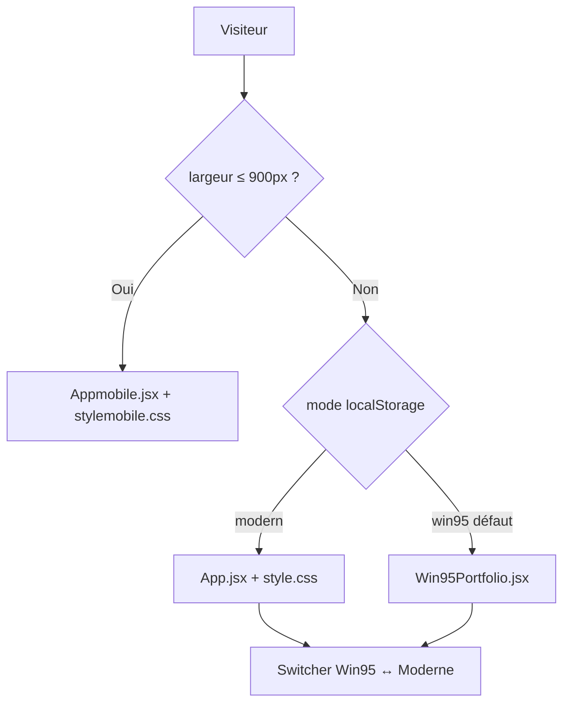

<div align="center">


<br /><br />

# AKAFOLIO — Elvis M'BOLLO

**Portfolio interactif full-stack** · React 18 · WebGL · GSAP · Neo-Brutalism

<br />

[](https://akafolio160502.vercel.app/)
[](https://akatech.vercel.app/)

<br />


<br />

*SPA · 3 expériences (Desktop / Mobile / Win95) · Thèmes clair/sombre · Animations immersives*

</div>

---

## Sommaire

- [À propos](#à-propos)
- [Aperçu rapide](#aperçu-rapide)
- [Architecture](#architecture)
- [Fonctionnalités](#fonctionnalités)
- [Stack technique](#stack-technique)
- [Structure du projet](#structure-du-projet)
- [Installation](#installation)
- [Déploiement](#déploiement)
- [Projets en production](#projets-en-production)
- [Services & tarifs](#services--tarifs)
- [Design system](#design-system)
- [Changelog](#changelog)
- [Contact](#contact)

---

## À propos

**AKAFOLIO** est le portfolio personnel d'Elvis M'BOLLO — développeur web full-stack basé à Abidjan. C'est une SPA React conçue comme vitrine technique : animations au scroll, galerie WebGL, carte GitHub en temps réel et bascule entre une interface **neo-brutalism** moderne et un **easter egg Windows 95**.

Tout est codé sur mesure (pas de librairie UI type MUI/Chakra). Trois expériences coexistent dans un seul dépôt, orchestrées par `main.jsx`.

---

## Aperçu rapide

| | |
|---|---|
| **Démo** | [akafolio160502.vercel.app](https://akafolio160502.vercel.app/) |
| **Agence** | [akatech.vercel.app](https://akatech.vercel.app/) |
| **Repo** | [github.com/wthomasss06-stack/portfolio-REACT](https://github.com/wthomasss06-stack/portfolio-REACT) |
| **Dev local** | `http://localhost:3000` (port configuré dans `vite.config.js`) |
| **Breakpoint mobile** | `≤ 900px` |

> Sur desktop, le **mode Win95** s'affiche au premier chargement. Utilisez le bouton fixe en bas à droite pour passer au portfolio moderne. Le choix est mémorisé dans `localStorage` (`akafolio-mode`).

---

## Architecture

`main.jsx` détecte le viewport, injecte le bon CSS et monte la bonne application :



| Expérience | Fichier principal | Styles | Quand |
|---|---|---|---|
| **Desktop moderne** | `App.jsx` | `style.css` (injecté via Vite `?inline`) | Desktop + mode `modern` |
| **Mobile** | `Appmobile.jsx` | `stylemobile.css` | Viewport `≤ 900px` + mode `modern` |
| **Win95** | `Win95Portfolio.jsx` | Styles intégrés au composant | Desktop + mode `win95` |

**Détails d'orchestration**

- Détection : `window.matchMedia('(max-width: 900px)')` + écoute `resize`
- CSS dynamique : balise `<style id="dynamic-portfolio-styles">` alimentée par les imports `style.css?inline` / `stylemobile.css?inline`
- Persistance du mode : clé `akafolio-mode` (`win95` \| `modern`)
- Switcher : visible uniquement sur desktop (bouton style Windows 95 en bas à droite)

---

## Fonctionnalités

### Desktop (`App.jsx`)

| Section | Détail |
|---|---|
| **Loader** | Écran de chargement animé (scan line, messages dynamiques) |
| **Navbar** | Logo, horloge temps réel, statut disponible, toggle thème neo-brutalism |
| **Hero** | Fond `Iridescence` (WebGL OGL), `TextPressure` sur le nom — **toujours sombre** |
| **Sticky panels** | Services défilants (GSAP ScrollTrigger) |
| **About** | Portrait, typo premium, `ScrambleText` |
| **Timeline** | Parcours chronologique + `ScrollReveal` |
| **Skills** | 40+ icônes technologies en CSS pur |
| **Showcase** | Carousel de services |
| **Pricing** | 4 catégories, onglets neo-brutalism, icônes animées |
| **Galerie OGL** | Cartes paysage 800×550, distorsion au scroll |
| **GitHub card** | Stats live via GitHub API + contributions |
| **Testimonials** | Carousel horizontal |
| **Contact** | Formulaire → [FormSubmit](https://formsubmit.co/) (sans backend) |
| **Footer** | SVG animé, QR CV, lien AKATech |

### Mobile (`Appmobile.jsx`)

Interface tactile dédiée (`stylemobile.css`) : navigation drawer, cartes empilées, sections adaptées au pouce.

### Win95 (`Win95Portfolio.jsx`)

Easter egg interactif : bureau, icônes, fenêtres redimensionnables, menu Démarrer.

### Thèmes (desktop moderne)

| Mode | Fond | Accent | Activation |
|---|---|---|---|
| **Sombre** (défaut) | `#0A0A0A` | `#FF5500` | 18h–6h ou bouton manuel |
| **Clair** | `#F2EDE8` | `#0A0A0A` | Bouton neo-brutalism |

Le hero reste en thème sombre quelle que soit la sélection globale.

---

## Stack technique

| Couche | Technologies |
|---|---|
| **Build** | Vite 5, `@vitejs/plugin-react` |
| **UI** | React 18, Lucide React |
| **Styles** | CSS custom properties, Tailwind 4 (PostCSS, usage partiel) |
| **Animations** | GSAP 3 + ScrollTrigger, ScrollReveal, Framer Motion |
| **WebGL / 3D** | OGL (galerie), Three.js (`ScrollDepthScene`), postprocessing |
| **Effets** | Composants maison : `ScrambleText`, `TextPressure`, `RotatingText`, `TargetCursor`, `ScrollFloat`, `Iridescence`, `GridScan` (face-api.js) |
| **Contact** | FormSubmit AJAX |
| **API externes** | GitHub REST, github-contributions-api |
| **Hébergement** | Vercel (CI depuis GitHub) |

---

## Structure du projet

```
elvis-portfolio/
├── public/
│   ├── assets/images/       # logos, QR CV, visuels projets
│   └── demos/               # démos HTML standalone (galerie)
│
├── src/
│   ├── main.jsx             # routeur device + mode + injection CSS
│   ├── App.jsx              # portfolio desktop + données (PROJECTS, PRICING…)
│   ├── Appmobile.jsx        # version mobile
│   ├── Win95Portfolio.jsx   # easter egg Win95
│   ├── style.css            # thèmes, variables, animations desktop
│   ├── stylemobile.css      # styles mobile-first
│   ├── scope-reset.css
│   ├── index.css
│   └── components/
│       ├── ScrollDepthScene.jsx
│       ├── ScrambleText.jsx
│       ├── ScrollReveal.jsx
│       ├── TextPressure.jsx
│       ├── RotatingText.jsx
│       ├── TargetCursor.jsx
│       ├── ScrollFloat.jsx
│       ├── Iridescence.jsx
│       └── GridScan.jsx
│
├── index.html
├── vite.config.js           # port 3000, base relative ./
├── tailwind.config.js
└── package.json
```

---

## Installation

### Prérequis

- **Node.js** ≥ 18
- **npm** ≥ 9 (ou équivalent : pnpm, yarn)

### Commandes

```bash
# Cloner
git clone https://github.com/wthomasss06-stack/portfolio-REACT.git
cd portfolio-REACT

# Dépendances
npm install

# Développement (ouvre le navigateur sur le port 3000)
npm run dev

# Build production → dossier dist/
npm run build

# Prévisualiser le build
npm run preview
```

| Script | Action |
|---|---|
| `npm run dev` | Serveur Vite en dev (`localhost:3000`) |
| `npm run build` | Bundle optimisé dans `dist/` |
| `npm run preview` | Sert le build localement |

> Le formulaire de contact envoie vers FormSubmit avec l'adresse configurée dans `App.jsx`. Aucune variable d'environnement n'est requise pour un usage local standard.

---

## Déploiement

Le projet est prêt pour **Vercel** (ou tout hébergeur statique) :

1. Connecter le dépôt GitHub `wthomasss06-stack/portfolio-REACT`
2. Framework preset : **Vite**
3. Build command : `npm run build`
4. Output directory : `dist`
5. `base: './'` dans `vite.config.js` — compatible chemins relatifs

Push sur `main` → déploiement automatique sur [akafolio160502.vercel.app](https://akafolio160502.vercel.app/).

---

## Projets en production

| Projet | Description | Stack | Lien |
|---|---|---|---|
| **AKATech** | Agence digitale — site officiel | Next.js 15, Framer Motion, WebGL | [akatech.vercel.app](https://akatech.vercel.app/) |
| **ShopCI** | Marketplace multi-vendeurs CI | React, Django, Bootstrap | [shop-ci.vercel.app](https://shop-ci.vercel.app/) |
| **TechFlow** | Site vitrine professionnel | HTML, Tailwind, JS | [techflow-ten.vercel.app](https://techflow-ten.vercel.app/) |
| **TerraSafe** | Anti-arnaque foncière | Flask, MySQL, Bootstrap | [wthomassss06.pythonanywhere.com](https://wthomassss06.pythonanywhere.com) |
| **Tati** | Portfolio double vitrine | React, Tailwind, Framer Motion | [tatii.vercel.app](https://tatii.vercel.app/) |
| **MK** | Portfolio graphiste | React, Tailwind, Framer Motion | [mory01ff.vercel.app](https://mory01ff.vercel.app/) |
| **ManoBeat 777** | Portfolio beatmaker | React, Howler.js | [xxx-x.vercel.app](https://xxx-x.vercel.app/) |
| **New Horizon Service** | Location meublée | Next.js, Flask, MySQL | [new-horizonservice.vercel.app](https://new-horizonservice.vercel.app/) |
| **Université les Anges** | Site institutionnel | HTML, CSS, Bulma | [universitelesanges.vercel.app](https://universitelesanges.vercel.app/) |

Quatre démos HTML supplémentaires sont accessibles depuis la galerie du portfolio (`public/demos/`).

---

## Services & tarifs

> Tous les plans incluent un **nom de domaine offert (1 an)**.

<details>
<summary><b>Portfolio personnel</b></summary>

| Plan | Prix | Délai |
|---|---|---|
| Starter | 70 000 FCFA | 3–5 jours |
| Pro | 120 000 FCFA | 5–7 jours |
| Elite | 180 000 FCFA | 7–10 jours |

</details>

<details>
<summary><b>Site vitrine</b></summary>

| Plan | Prix | Délai |
|---|---|---|
| Starter | 150 000 FCFA | 5 jours |
| Pro | 270 000 FCFA | 7–10 jours |
| Premium | 450 000 FCFA | 10–14 jours |

</details>

<details>
<summary><b>E-commerce</b></summary>

| Plan | Prix | Délai |
|---|---|---|
| Starter | 400 000 FCFA | 14 jours |
| Pro | 650 000 FCFA | 21 jours |
| Scale | 1 000 000 FCFA | 30 jours |

</details>

<details>
<summary><b>Application SaaS / Web App</b></summary>

| Plan | Prix | Délai |
|---|---|---|
| MVP | 700 000 FCFA | 3–4 semaines |
| Pro | Sur devis | 4–6 semaines |
| Enterprise | À partir de 2 500 000 FCFA | 6–10 semaines |

</details>

---

## Design system

Variables CSS principales (`style.css`) :

```css
:root {
  --accent: #FF5500;
  --text:   #F2EDE8;
  --bg:     #0A0A0A;
  --muted:  rgba(242, 237, 232, 0.45);
  --fd: 'Outfit', 'Syne', sans-serif;           /* titres */
  --fb: 'Plus Jakarta Sans', sans-serif;        /* corps */
}

body.light-mode {
  --text:  #0A0A0A;
  --bg:    #F2EDE8;
  --muted: rgba(10, 10, 10, 0.45);
}
```

**Typographies** : Outfit, Plus Jakarta Sans, Space Mono, Syne (Google Fonts).

---

## Changelog

### v3.4 — Mai 2026

- Architecture **3 versions** clarifiée via `main.jsx`
- Typo **Outfit** + **Plus Jakarta Sans**
- Galerie OGL : cartes rectangulaires 800×550
- Hero verrouillé en mode sombre
- Bouton thème neo-brutalism, footer AKATech cliquable
- Titres « Mes Réalisations » et « Restons connectés. » en `ScrollReveal`

### v3.3 — Avril 2026

- `PricingAnimIcon`, `StackedCard` mobile, `ScrambleText` étendu

### v3.2 — Avril 2026

- `ScrollDepthScene` Three.js, système d'icônes skills v2, testimonials

### v3.0–v3.1 — Mars 2026

- Loader scan line, carte AKATech 100 % CSS

### v2.0 — Janvier 2026

- FanDeck 3D glassmorphism, filtres pill, pricing tabs

### v1.0 — 2025

- Version initiale SPA React

---

## Contact

**Elvis M'BOLLO** — Développeur Web Full-Stack — Abidjan, Côte d'Ivoire

[](mailto:wthomasss06@gmail.com)
[](https://www.linkedin.com/in/m-bollo-aka-60a1b1340/)
[](https://github.com/wthomasss06-stack)
[](https://wa.me/2250142507750)
[](https://akatech.vercel.app/)

---

<div align="center">

© 2026 Elvis M'BOLLO — MIT License

</div>
