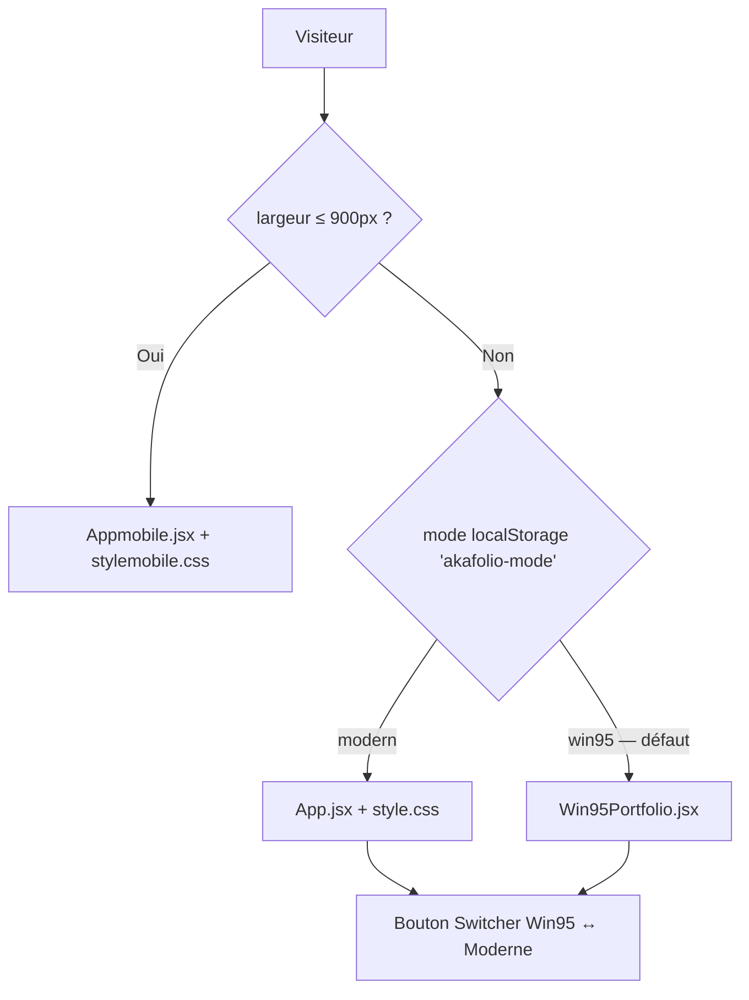

<div align="center">


<br /><br />

# AKAFOLIO — Elvis M'BOLLO

**Portfolio interactif full-stack** · React 18 · WebGL · GSAP · Neo-Brutalism

<br />

[](https://akafolio160502.vercel.app/)
[](https://akatech.vercel.app/)

<br />


<br />

*SPA · 4 expériences (Desktop / Mobile / Win95 / V4 en chantier) · Thèmes clair/sombre · Animations immersives*

</div>


## Sommaire

- [À propos](#à-propos)
- [Aperçu rapide](#aperçu-rapide)
- [Architecture](#architecture)
- [Les 4 expériences](#les-4-expériences)
- [Stack technique](#stack-technique)
- [Bibliothèque de composants](#bibliothèque-de-composants)
- [Structure du projet](#structure-du-projet)
- [Formulaire de contact (API Resend)](#formulaire-de-contact-api-resend)
- [Installation](#installation)
- [Déploiement](#déploiement)
- [Projets en production](#projets-en-production)
- [Services & tarifs](#services--tarifs)
- [Design system](#design-system)
- [Dette technique connue](#dette-technique-connue)
- [Contact](#contact)

---

## À propos

**AKAFOLIO** est le portfolio personnel d'Elvis M'BOLLO (AKATech) — développeur web full-stack basé à Abidjan, Côte d'Ivoire. C'est une SPA React conçue comme vitrine technique : animations au scroll pilotées par GSAP, fonds WebGL (OGL / Three.js via React Three Fiber), carte GitHub en temps réel, formulaire de contact avec vrai envoi d'email (Resend), et bascule entre une interface **neo-brutalism** moderne et un **easter egg Windows 95** entièrement reconstitué (fenêtres, bureau, menu Démarrer).

Tout est codé sur mesure, sans librairie UI (pas de MUI/Chakra). Le projet contient **quatre expériences front** dans le même dépôt — trois actives, une en chantier — orchestrées par `main.jsx`.

---

## Aperçu rapide

| | |
|---|---|
| **Démo** | [akafolio160502.vercel.app](https://akafolio160502.vercel.app/) |
| **Agence** | [akatech.vercel.app](https://akatech.vercel.app/) |
| **Dev local** | `http://localhost:3000` (port fixé dans `vite.config.js`) |
| **Breakpoint mobile** | `≤ 900px` |

> Sur desktop, le **mode Win95** s'affiche au premier chargement. Le bouton fixe en bas à droite (visible desktop uniquement) bascule vers le portfolio moderne. Le choix est mémorisé dans `localStorage` (`akafolio-mode`).

---

## Architecture

`main.jsx` est l'unique point d'entrée. Il détecte le viewport, injecte dynamiquement la bonne feuille de style, et monte **un seul** arbre React à la fois (volontaire : monter les trois en parallèle avec `display:none` cassait les ancres `#contact`, etc.) :



| Expérience | Fichier principal | Styles | Monté quand | Statut |
|---|---|---|---|---|
| **Win95** | `Win95Portfolio.jsx` | CSS injecté en JS (`injectCSS()`) | Desktop + mode `win95` (défaut) | ✅ actif |
| **Desktop moderne** | `App.jsx` | `style.css` (Vite `?inline`) | Desktop + mode `modern` | ✅ actif |
| **Mobile** | `Appmobile.jsx` | `stylemobile.css` (Vite `?inline`) | Viewport `≤ 900px` | ⚠️ actif mais build cassé (voir ci-dessus) |
| **V4 (refonte)** | `Appv4.jsx` | `stylev4.css` | — | 🚧 non branché dans `main.jsx` |

**Détails d'orchestration**

- Détection viewport : `window.matchMedia('(max-width: 900px)')`, réévalué au `resize`.
- CSS dynamique : balise unique `<style id="dynamic-portfolio-styles">` repeuplée selon `mode` + `isMobile`, à partir des imports `style.css?inline` / `stylemobile.css?inline`.
- Persistance du mode : clé `localStorage` `akafolio-mode` (`win95` | `modern`).
- En mode Win95, `overflow:hidden` est forcé sur `<html>/<body>/#root` (bureau plein écran, pas de scroll de page) ; restauré au passage en `modern`.
- Le switcher n'est rendu que sur desktop (`!isMobile`).

---

## Les 4 expériences

### 🖥️ Win95 (`Win95Portfolio.jsx` — 2566 lignes)

Easter egg complet : bureau Windows 95/XP avec curseur custom, horloge, boot screen avec canvas WebGL, icônes de bureau draggables, fenêtres redimensionnables/déplaçables avec z-index management, menu Démarrer, taskbar avec fenêtres minimisées, lightbox galerie. Chaque section du portfolio (À propos, Projets, Compétences, Services, Contact, FAQ) est une **fenêtre** (`Window`) ouverte depuis le bureau ou le menu Démarrer.

Toutes les données du portfolio (projets, compétences, timeline, services, tarifs, FAQ) sont centralisées en haut de ce fichier (objets `ME`, `PROJECTS`, `SKILLS`, `TIMELINE`, `SERVICES_DATA`, `PRICING_TABS`, `FAQ`) — c'est la **source de vérité** la plus complète et la plus à jour du contenu (18 projets référencés à ce jour, jusqu'à *MD Laverie Pressing* et *Jean Edy · Portfolio*, 2026).

### 🟧 Desktop moderne (`App.jsx` — 3712 lignes)

Esthétique neo-brutalism (ombres dures décalées, bordures épaisses) sur fond sombre par défaut (`#0A0A0A` / accent `#FF5500`), bascule vers thème clair possible. Sections : Loader → Navbar (horloge live, toggle thème) → Hero (`Iridescence` WebGL + `TextPressure`) → Marquee → Featured creations (carousel 3 slides) → Projets (scroll horizontal piloté GSAP) → About (stats animées, `ScrambleText`) → Timeline → Skew section → Skills (bandes défilantes) → Process (scroll horizontal sticky, cartes marquee façon `FlowingMenu`) → Services → Pricing (cartes façon billets de cinéma empilés) → Galerie OGL → Carte GitHub interactive (API GitHub réelle + fallback) → Testimonials → FAQ → Contact (POST `/api/contact`) → Footer (fond transparent, `BeamsInteractive`).

Transitions de section via `GooeyTransition` (effet "staircase" façon Barba.js, 8 colonnes en stagger GSAP).

### 📱 Mobile (`Appmobile.jsx` — 4225 lignes)

Réécriture mobile-first complète, pas un simple reflow du desktop : son propre Hero, son propre fond animé (`PlasmaCanvasBg`, `AuroraCanvas`), ses propres variantes de cartes (`FanDeck`, `SpotlightProjects`, `TiltCard`, `StackedCard`), navigation tactile, carte GitHub adaptée. **⚠️ build cassé** — voir l'avertissement en haut de ce document.

### 🚧 V4 — refonte en cours (`Appv4.jsx` — 3416 lignes, non monté)

Brouillon de nouvelle version du desktop, pas encore branché dans `main.jsx` (aucune référence à `Appv4` dans le reste du code). Par rapport à `App.jsx`, V4 remplace :
- le hero scramble-text (`useSHCycleText`/`useSHNameCycle`) par `useSplitTextReveal` ;
- les sections Process / Services / FAQ par un trio `StickyStack` (carousel mobile 3D) + `ShowcaseSection` + `GallerySection`.

Il manque encore l'équivalent des sections Services/Process/FAQ de `App.jsx` pour atteindre la parité fonctionnelle. `convert_to_webp.py` cible spécifiquement ce fichier par défaut (`--appv4 src/Appv4.jsx`) pour la migration des chemins d'images vers `.webp`.

---

## Stack technique

| Couche | Technologies |
|---|---|
| **Build** | Vite 5, `@vitejs/plugin-react` |
| **UI** | React 18 |
| **Styles** | CSS custom properties (pas de CSS Modules), Tailwind 4 via `@tailwindcss/postcss` (usage partiel/utilitaire) |
| **Animations** | GSAP 3 (+ `ScrollTrigger`, `Observer`), Framer Motion, `motion` |
| **WebGL / 3D** | OGL (`Iridescence`), Three.js + `@react-three/fiber` + `@react-three/drei` + `@react-three/rapier` (`Lanyard` physique), `postprocessing` |
| **Reconnaissance faciale** | `face-api.js` (`GridScan.jsx`) |
| **Icônes** | `lucide-react`, Font Awesome Free |
| **Contact** | API serverless Vercel (`api/contact.js`) + **Resend** pour l'envoi d'email réel |
| **API externes consommées** | GitHub REST API, `github-contributions-api.jogruber.de` |
| **Routing** | `react-router-dom` listé en dépendance mais non utilisé activement (SPA à sections ancrées, pas de routes) |
| **Hébergement** | Vercel (functions serverless pour `/api/contact`) |

---

## Bibliothèque de composants

`src/components/` contient ~35 composants réutilisables, pour l'essentiel des adaptations maison dans l'esprit *react-bits* :

| Composant | Rôle |
|---|---|
| `Beams.jsx` | Fond de faisceaux lumineux 3D (R3F) |
| `CardSwap.jsx` | Pile de cartes qui s'échangent en boucle |
| `FireAkatech.jsx` / `FireBackground.jsx` | Effets de flammes animées GSAP |
| `FlowingMenu.jsx` | Menu marquee au survol (utilisé dans `ProcessSection`) |
| `GooeyTransition.jsx` | Transition "staircase" entre sections (8 colonnes GSAP) |
| `GridScan.jsx` | Scan facial temps réel (`face-api.js` + post-processing bloom/aberration chromatique) |
| `HorizontalSections.jsx` / `SectionSlider.jsx` | Scroll horizontal piloté par `Observer` GSAP |
| `ImageTrail.jsx` | Traînée d'images qui suit le curseur |
| `InfiniteMenu.jsx` | Menu sphérique 3D infini (WebGL, `gl-matrix`) |
| `Iridescence.jsx` | Fond shader irisé (OGL) — utilisé dans le Hero desktop |
| `Lanyard.jsx` | Badge 3D suspendu avec physique réaliste (`@react-three/rapier`) |
| `RotatingText.jsx` | Rotation de mots (Framer Motion) |
| `ScrambleText.jsx` / `Shuffle.jsx` / `ShuffleText.jsx` | Effets de texte "décodage" |
| `ScrollFloat.jsx` / `ScrollReveal.jsx` | Révélations animées au scroll |
| `Stack.jsx` | Pile de cartes drag-to-dismiss |
| `StaggeredMenu.jsx` | Menu hamburger/drawer avec stagger d'items |
| `TargetCursor.jsx` | Curseur custom avec ciblage sur éléments interactifs |
| `TextPressure.jsx` | Typographie réactive à la position du curseur |
| `SoundToggle.jsx` / `useClickSound.js` | Système de sons de clic synthétisés (Web Audio API, zéro asset) |
| `ui/icon-cloud.jsx` | Nuage d'icônes tech |

⚠️ `ScrollDepthScene.jsx` n'appartient pas à cette liste : voir [État du build](#️-état-du-build--à-lire-avant-de-cloner).

---

## Structure du projet

```
elvis-portfolio/
├── api/
│   └── contact.js            # Endpoint serverless Vercel — envoi email via Resend
├── public/                   # Non inclus dans cette archive (assets images/CV)
│
├── src/
│   ├── main.jsx               # Routeur device + mode + injection CSS dynamique
│   ├── App.jsx                # Desktop moderne (actif)
│   ├── Appmobile.jsx          # Mobile (actif, build cassé — voir avertissement)
│   ├── Appv4.jsx               # Refonte V4 (non montée dans main.jsx)
│   ├── Win95Portfolio.jsx      # Easter egg Win95 (actif, données portfolio centralisées)
│   ├── style.css               # Thème desktop moderne
│   ├── stylemobile.css         # Thème mobile
│   ├── stylev4.css             # Thème V4
│   ├── fonts.css               # Polices @fontsource (zéro CDN externe)
│   ├── index.css
│   ├── components/             # ~35 composants animés réutilisables (voir tableau ci-dessus)
│   │   └── ScrollDepthScene.jsx   # ⚠️ CSS pur mal nommé — casse le build (voir avertissement)
│   └── hooks/
│       └── useImmersiveSound.js   # Musique d'ambiance procédurale — non importé, code mort
│
├── convert_to_webp.py         # Script de migration .png/.jpg → .webp (cible Appv4.jsx par défaut)
├── index.html
├── vite.config.js             # Port 3000, base relative './' , proxy /api → :3001 en dev
├── vercel.json                # Rewrites + headers CORS pour /api
├── tailwind.config.js
└── package.json
```

---

## Formulaire de contact (API Resend)

Contrairement à une version antérieure qui utilisait FormSubmit, **le formulaire envoie désormais vers une vraie API serverless** (`api/contact.js`), appelée en `POST /api/contact` depuis les trois apps actives (`App.jsx`, `Appmobile.jsx`, `Appv4.jsx`).

Fonctionnalités de l'endpoint :
- **Validation stricte** : nom (≤100 car.), email (regex), message (10–5000 car.)
- **Anti-spam honeypot** : champ caché `company` — si rempli, réponse `200` factice sans envoi
- **Rate-limit naïf en mémoire** : 3 messages / IP / minute (best-effort, se réinitialise si la fonction redémarre)
- **Échappement HTML** des champs avant injection dans le template d'email (anti-injection)
- **Envoi via Resend**, email HTML stylé (thème sombre + accent orange), destinataire configurable via `ADMIN_EMAIL`

**Variables d'environnement requises en production** :

| Variable | Rôle | Défaut |
|---|---|---|
| `RESEND_API_KEY` | Clé API Resend (obligatoire) | — |
| `FROM_EMAIL` | Adresse d'expédition | `onboarding@resend.dev` |
| `ADMIN_EMAIL` | Adresse de réception | `wthomasss06@gmail.com` |

En dev local, pour tester l'API : `vercel dev --listen 3001` dans un terminal, puis `npm run dev` dans un autre (le proxy `/api` de `vite.config.js` redirige vers le port 3001).

---

## Installation

### Prérequis

- **Node.js** ≥ 18
- **npm** ≥ 9 (ou pnpm/yarn équivalent)
- (Optionnel, pour tester le contact en local) **Vercel CLI** (`npm i -g vercel`) + un compte [Resend](https://resend.com/)

### Commandes

```bash
# Dépendances
npm install

# Développement (ouvre le navigateur sur localhost:3000)
npm run dev

# Build production → dossier dist/
# ⚠️ échoue actuellement, voir "État du build" en haut du document
npm run build

# Prévisualiser le build
npm run preview
```

| Script | Action |
|---|---|
| `npm run dev` | Serveur Vite en dev (`localhost:3000`) |
| `npm run build` | Bundle optimisé dans `dist/` — **cassé tant que `ScrollDepthScene.jsx` n'est pas corrigé** |
| `npm run preview` | Sert le build localement |

---

## Déploiement

Projet pensé pour **Vercel** :

1. Framework preset : **Vite**
2. Build command : `npm run build`
3. Output directory : `dist`
4. Renseigner `RESEND_API_KEY` (+ optionnellement `FROM_EMAIL`, `ADMIN_EMAIL`) dans les variables d'environnement du projet Vercel
5. `vercel.json` gère déjà les rewrites et headers CORS pour `/api/*`

**Corriger `ScrollDepthScene.jsx` avant tout déploiement** — `vercel build` échouera avec la même erreur esbuild que `npm run build` en local.

---

## Projets en production

Source de vérité : tableau `PROJECTS` dans `Win95Portfolio.jsx` (le plus complet et le plus récent — 18 entrées, dont les ajouts 2026).

| Projet | Description | Stack | Lien |
|---|---|---|---|
| **AKATech** | Agence digitale — site officiel | Next.js 15, Framer Motion, WebGL Aurora | [akatech.vercel.app](https://akatech.vercel.app/) |
| **ShopCI** | Marketplace multi-vendeurs CI | React, Django, Bootstrap 5 | [shop-ci.vercel.app](https://shop-ci.vercel.app/) |
| **TechFlow** | Site vitrine professionnel | HTML, Tailwind, JS | [techflow-ten.vercel.app](https://techflow-ten.vercel.app/) |
| **TerraSafe** | Anti-arnaque foncière | Flask, MySQL, Bootstrap | [wthomassss06.pythonanywhere.com](https://wthomassss06.pythonanywhere.com) |
| **NEXURA** | Marketplace nouvelle génération (évolution de TerraSafe) | Next.js 14, Django REST, PostgreSQL, WebSockets, Redis/Celery | [nexura-one.vercel.app](https://nexura-one.vercel.app/) |
| **KokoEat** | Livraison alimentaire, paiement Mobile Money | React, Django REST, PostgreSQL | *en cours* |
| **Tati** | Portfolio double vitrine | React, Tailwind, Framer Motion | [tatii.vercel.app](https://tatii.vercel.app/) |
| **MK** | Portfolio graphiste client | React, Tailwind, Framer Motion | [mory01ff.vercel.app](https://mory01ff.vercel.app/) |
| **ManoBeat 777** | Portfolio beatmaker | React, Howler.js | [xxx-x.vercel.app](https://xxx-x.vercel.app/) |
| **New Horizon** | Location de résidences meublées | Next.js, Flask, MySQL | [new-horizonservice.vercel.app](https://new-horizonservice.vercel.app/) |
| **Université les Anges** | Site institutionnel | HTML, CSS, Bulma, Bootstrap | [universitelesanges.vercel.app](https://universitelesanges.vercel.app/) |
| **Jean Edy · Portfolio** | Portfolio React UI avancé, multilingue | React 18, Vite, GSAP, Framer Motion | [jean-edy-dev.vercel.app](https://jean-edy-dev.vercel.app/) |
| **MD Laverie Pressing** | Site vitrine pressing Abidjan | React 18, Vite, GSAP, React Router | [laverie-plus.vercel.app](https://laverie-plus.vercel.app/) |

Quatre démos HTML standalone supplémentaires (`Chap-chapMAP`, `ElvisMarket`, `MonCashJour`, `LivreurTrack Pro`) ainsi qu'un SaaS en cours (`LinkedIn Banner Pro`) sont accessibles depuis la galerie projets du portfolio (`/demos/*.html`).

---

## Services & tarifs

> Tous les plans incluent un **nom de domaine offert (1 an)** et l'hébergement.

<details>
<summary><b>Portfolio personnel</b></summary>

| Plan | Prix | Délai |
|---|---|---|
| Starter | 70 000 FCFA | 3–5 jours |
| Standard | 120 000 FCFA | 5–7 jours |
| Premium | 180 000 FCFA | 7–10 jours |

</details>

<details>
<summary><b>Site vitrine</b></summary>

| Plan | Prix | Délai |
|---|---|---|
| Starter | 150 000 FCFA | 5 jours |
| Pro | 270 000 FCFA | 7–10 jours |
| Elite | 450 000 FCFA | 10–14 jours |

</details>

<details>
<summary><b>E-commerce</b></summary>

| Plan | Prix | Délai |
|---|---|---|
| Starter | 400 000 FCFA | 14 jours |
| Pro | 650 000 FCFA | 21 jours |
| Elite | 1 000 000 FCFA | 30 jours |

</details>

<details>
<summary><b>Application SaaS / Web App</b></summary>

| Plan | Prix | Délai |
|---|---|---|
| MVP | 700 000 FCFA | 3–4 semaines |
| Scale | 1 200 000 – 2 000 000 FCFA | 4–6 semaines |
| Enterprise | À partir de 2 500 000 FCFA | 6–10 semaines |

</details>

---

## Design system

Variables CSS principales (`style.css`, thème desktop) :

```css
:root {
  --bg:      #0A0A0A;
  --accent:  #FF5500;
  --text:    #F2EDE8;
}

body.light-mode {
  --bg:    #FFFFFF;
  --text:  #0A0A0A;
}
```

Le **Hero reste verrouillé en thème sombre** quelle que soit la sélection globale claire/sombre.

**Typographies** (bundlées via `@fontsource`, zéro CDN externe) : Outfit, Syne, Space Mono, Plus Jakarta Sans, Lora — avec alias `Cabinet Grotesk`/`Clash Display` pointant vers Syne en local.

---

---

## Contact

**Elvis M'BOLLO** — Développeur Web Full-Stack — Abidjan, Côte d'Ivoire

[](mailto:wthomasss06@gmail.com)
[](https://www.linkedin.com/in/m-bollo-aka-60a1b1340/)
[](https://github.com/wthomasss06-stack)
[](https://wa.me/2250142507750)
[](https://akatech.vercel.app/)

---

<div align="center">

© 2026 Elvis M'BOLLO — MIT License

</div>