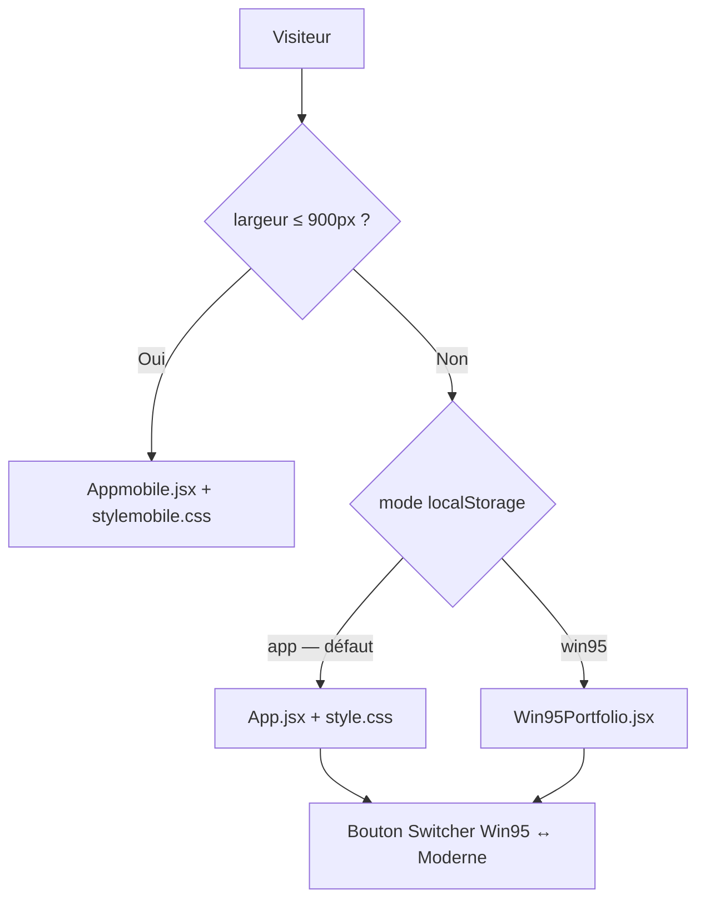

<div align="center">


<br /><br />
# AKAFOLIO — Elvis M'BOLLO

**Portfolio interactif full-stack** · React 18 · WebGL · GSAP · Neo-Brutalism

[](https://mbolloaka-dev.vercel.app/)
[](https://akatech.vercel.app/)


*SPA · 3 expériences actives (Desktop / Mobile / Win95) · Thèmes clair/sombre · Animations immersives*

</div>

---

## Sommaire

- [À propos](#à-propos)
- [Architecture](#architecture)
- [Les 3 expériences](#les-3-expériences)
- [Stack technique](#stack-technique)
- [Bibliothèque de composants](#bibliothèque-de-composants)
- [Structure du projet](#structure-du-projet)
- [Formulaire de contact](#formulaire-de-contact)
- [Installation](#installation)
- [Déploiement](#déploiement)
- [Projets en production](#projets-en-production)
- [Services & tarifs](#services--tarifs)
- [Design system](#design-system)
- [Contact](#contact)

---

## À propos

**AKAFOLIO** est le portfolio personnel d'Elvis M'BOLLO (AKATech) — développeur web full-stack basé à Abidjan, Côte d'Ivoire. SPA React conçue comme vitrine technique : animations au scroll pilotées par GSAP, fonds WebGL (OGL / Three.js via React Three Fiber), carte GitHub en temps réel, formulaire de contact avec envoi d'email réel via Resend, et bascule entre une interface **neo-brutalism** moderne et un **easter egg Windows 95** entièrement reconstitué.

Tout est codé sur mesure, sans librairie UI (pas de MUI/Chakra). Le projet regroupe trois expériences front dans le même dépôt — orchestrées par `RootApp.jsx` — plus une quatrième en chantier (`Appv4.jsx`).

---

## Architecture

`RootApp.jsx` est le chef d'orchestre. Il détecte le viewport, injecte dynamiquement la bonne feuille de style, et monte **un seul** arbre React à la fois (monter les trois en parallèle avec `display:none` cassait les ancres de navigation) :



| Expérience | Fichier principal | Styles | Statut |
|---|---|---|---|
| **Desktop moderne** | `App.jsx` | `style.css` (Vite `?inline`) | ✅ actif |
| **Mobile** | `Appmobile.jsx` | `stylemobile.css` (Vite `?inline`) | ✅ actif |
| **Win95** | `Win95Portfolio.jsx` | CSS injecté en JS | ✅ actif |
| **V4 (refonte)** | `Appv4.jsx` | `stylev4.css` | 🚧 non branché |

**Détails d'orchestration**

- Détection viewport : `window.matchMedia('(max-width: 900px)')`, réévalué au resize via `useIsMobile()`.
- CSS dynamique : balise unique `<style id="dynamic-portfolio-styles">` repeuplée selon `mode` + `isMobile`, à partir des imports `style.css?inline` / `stylemobile.css?inline`.
- Persistance du mode : clé `localStorage` `akafolio-mode` (`app` | `win95`).
- En mode Win95, `overflow:hidden` est forcé sur `<html>/<body>/#root` (bureau plein écran) ; restauré au passage en mode moderne.

---

## Les 3 expériences

### Desktop moderne (`App.jsx`)

Esthétique neo-brutalism sur fond sombre (`#0A0A0A` / accent `#FF5500`), bascule vers thème clair possible. Sections dans l'ordre : Loader → Navbar (horloge live, toggle thème) → Hero (`Iridescence` WebGL + `TextPressure`) → Marquee → Dernières réalisations (carousel 2 slides avec crossfade) → Projets (scroll horizontal GSAP) → About (stats animées, `ScrambleText`) → Timeline → Skew section → Skills (bandes défilantes) → Process (stepper scroll vertical, 7 étapes) → Services (sticky + crossfade image GSAP) → Pricing → Galerie OGL → Carte GitHub (API réelle + fallback) → Testimonials → FAQ (accordion CSS) → Contact → Footer.

Transitions de section via `GooeyTransition` (effet staircase, 8 colonnes en stagger GSAP). Navigation sticky avec `SECTION_NAV_GROUPS` pour le surlignage actif. `hardJumpTo` (8 frames, ~130ms) pour les sauts vers grandes sections sticky.

### Mobile (`Appmobile.jsx`)

R�écriture mobile-first complète, pas un reflow du desktop. Son propre Hero, ses propres fonds animés (`PlasmaCanvasBg`, `AuroraCanvas`), ses propres variantes de cartes (`FanDeck`, `SpotlightProjects`, `TiltCard`, `StackedCard`), navigation tactile. Menu hamburger `StaggeredMenu` avec animation GSAP (panneaux en cascade, items en stagger, icône plus ↔ X). Pricing par onglets (Portfolio / Vitrine / E-commerce / SaaS / Fiche Google), carte GitHub adaptée.

### Win95 (`Win95Portfolio.jsx`)

Easter egg complet : bureau Windows 95/XP avec curseur custom, horloge, boot screen WebGL, icônes de bureau draggables, fenêtres redimensionnables et déplaçables avec z-index management, menu Démarrer, taskbar. Chaque section du portfolio est une **fenêtre** ouverte depuis le bureau ou le menu Démarrer. Les données portfolio centralisées ici (`PROJECTS`, `SKILLS`, `TIMELINE`, `SERVICES_DATA`, `PRICING_TABS`, `FAQ`) constituent la source de vérité la plus complète.

---

## Stack technique

| Couche | Technologies |
|---|---|
| **Build** | Vite 5, `@vitejs/plugin-react` |
| **UI** | React 18 |
| **Styles** | CSS custom properties (pas de CSS Modules), Tailwind 4 via `@tailwindcss/postcss` (usage partiel) |
| **Animations** | GSAP 3 (ScrollTrigger, Observer), Framer Motion, `motion` |
| **WebGL / 3D** | OGL (`Iridescence`), Three.js + `@react-three/fiber` + `@react-three/drei` + `@react-three/rapier` (`Lanyard` physique), `postprocessing` |
| **Reconnaissance faciale** | `face-api.js` (`GridScan.jsx`) |
| **Icônes** | `lucide-react`, Font Awesome Free |
| **SEO** | `react-helmet-async` (`useSEO.jsx` — title, meta, Open Graph, structured data JSON-LD) |
| **Contact** | API serverless Vercel (`api/contact.js`) + **Resend** |
| **API externes** | GitHub REST API, `github-contributions-api.jogruber.de` |
| **Hébergement** | Vercel (fonctions serverless pour `/api/contact`) |

---

## Bibliothèque de composants

`src/components/` contient ~35 composants réutilisables, pour l'essentiel des adaptations maison :

| Composant | Rôle |
|---|---|
| `Beams.jsx` | Fond de faisceaux lumineux 3D (R3F) |
| `CardSwap.jsx` | Pile de cartes échangeables en boucle |
| `FireAkatech.jsx` / `FireBackground.jsx` | Effets de flammes GSAP |
| `FlowingMenu.jsx` | Menu marquee au survol (Process section) |
| `GooeyTransition.jsx` | Transition staircase entre sections (8 colonnes GSAP) — exporte aussi `hardJumpTo` |
| `GridScan.jsx` | Scan facial temps réel (`face-api.js` + bloom/aberration chromatique) |
| `HorizontalSections.jsx` / `SectionSlider.jsx` | Scroll horizontal piloté par `Observer` GSAP |
| `ImageTrail.jsx` | Traînée d'images suivant le curseur |
| `InfiniteMenu.jsx` | Menu sphérique 3D (WebGL, `gl-matrix`) |
| `Iridescence.jsx` | Fond shader irisé OGL — Hero desktop |
| `Lanyard.jsx` | Badge 3D avec physique réaliste (`@react-three/rapier`) |
| `RotatingText.jsx` | Rotation de mots (Framer Motion) |
| `ScrambleText.jsx` / `Shuffle.jsx` / `ShuffleText.jsx` | Effets texte "décodage" |
| `ScrollFloat.jsx` / `ScrollReveal.jsx` | Révélations animées au scroll |
| `Stack.jsx` | Pile de cartes drag-to-dismiss |
| `StaggeredMenu.jsx` | Hamburger GSAP — panneaux en cascade, stagger nav, morph plus ↔ X |
| `TargetCursor.jsx` | Curseur custom avec ciblage sur éléments interactifs |
| `TextPressure.jsx` | Typographie réactive à la position du curseur |
| `SoundToggle.jsx` / `useClickSound.js` | Sons de clic synthétisés (Web Audio API, zéro asset) |
| `AnimatedCounter.jsx` | Compteurs animés (stats About) |
| `ui/icon-cloud.jsx` | Nuage d'icônes tech |

---

## Structure du projet

```
elvis-portfolio/
├── api/
│   └── contact.js              # Endpoint serverless Vercel — envoi email via Resend
├── public/                     # Assets statiques (images, CV)
│
├── src/
│   ├── main.jsx                # Point d'entrée React (ReactDOM.createRoot)
│   ├── RootApp.jsx             # Orchestrateur : détection viewport, mode, CSS dynamique
│   ├── useSEO.jsx              # react-helmet-async — title, meta, OG, JSON-LD
│   ├── App.jsx                 # Desktop moderne
│   ├── Appmobile.jsx           # Mobile
│   ├── Win95Portfolio.jsx      # Easter egg Win95 (source de vérité du contenu)
│   ├── Appv4.jsx               # Refonte V4 (non montée)
│   ├── style.css               # Thème desktop
│   ├── stylemobile.css         # Thème mobile
│   ├── stylev4.css             # Thème V4
│   ├── fonts.css               # Polices @fontsource (zéro CDN externe)
│   ├── index.css
│   ├── components/             # ~35 composants animés (voir tableau ci-dessus)
│   └── hooks/
│       └── useImmersiveSound.js  # Musique d'ambiance procédurale Web Audio API (non importé)
│
├── convert_to_webp.py          # Migration .png/.jpg → .webp (cible Appv4.jsx par défaut)
├── index.html
├── vite.config.js              # Port 3000, proxy /api → :3001 en dev, manualChunks
├── vercel.json                 # Rewrite SPA fallback pour Vercel
├── tailwind.config.js
└── package.json
```

---

## Formulaire de contact

L'endpoint `api/contact.js` reçoit les `POST /api/contact` envoyés par les apps actives et envoie un email HTML stylisé via **Resend**.

Fonctionnalités :
- **Validation** : nom (≤ 100 car.), email (regex), message (10–5 000 car.)
- **Honeypot anti-spam** : champ caché `company` — si rempli, réponse `200` factice sans envoi
- **Rate-limit** : 3 messages / IP / minute (mémoire de la function, best-effort)
- **Échappement HTML** des champs avant injection dans le template (anti-injection)

**Variables d'environnement requises en production :**

| Variable | Rôle | Défaut |
|---|---|---|
| `RESEND_API_KEY` | Clé API Resend (obligatoire) | — |
| `FROM_EMAIL` | Adresse d'expédition | `onboarding@resend.dev` |
| `ADMIN_EMAIL` | Adresse de réception | `wthomasss06@gmail.com` |

En dev local : `vercel dev --listen 3001` dans un terminal, `npm run dev` dans un autre (le proxy `vite.config.js` redirige `/api` vers le port 3001).

---

## Installation

**Prérequis :** Node.js ≥ 18, npm ≥ 9. Vercel CLI optionnel pour tester l'API contact en local.

```bash
# Installer les dépendances
npm install

# Serveur de développement — ouvre localhost:3000
npm run dev

# Build production → dist/
npm run build

# Prévisualiser le build
npm run preview
```

---

## Déploiement

Pensé pour **Vercel** :

1. Framework preset : **Vite**
2. Build command : `npm run build`
3. Output directory : `dist`
4. Ajouter `RESEND_API_KEY` (+ optionnellement `FROM_EMAIL`, `ADMIN_EMAIL`) dans les variables d'environnement Vercel
5. `vercel.json` gère le rewrite SPA fallback (`/*` → `/index.html`)

---

## Projets en production

| Projet | Description | Stack | Lien |
|---|---|---|---|
| **AKATech** | Agence digitale — site officiel | Next.js 15, Framer Motion, WebGL | [akatech.vercel.app](https://akatech.vercel.app/) |
| **NEXURA** | Marketplace nouvelle génération | Next.js 14, Django REST, PostgreSQL, Redis | [nexura-one.vercel.app](https://nexura-one.vercel.app/) |
| **KokoEat** | Livraison alimentaire, Mobile Money | React, Django REST, PostgreSQL | *en cours* |
| **ShopCI** | Marketplace multi-vendeurs CI | React, Django, Bootstrap 5 | [shop-ci.vercel.app](https://shop-ci.vercel.app/) |
| **TechFlow** | Site vitrine professionnel | HTML, Tailwind, JS | [techflow-ten.vercel.app](https://techflow-ten.vercel.app/) |
| **TerraSafe** | Anti-arnaque foncière | Flask, MySQL, Bootstrap | [wthomassss06.pythonanywhere.com](https://wthomassss06.pythonanywhere.com) |
| **New Horizon** | Location de résidences meublées | Next.js, Flask, MySQL | [new-horizonservice.vercel.app](https://new-horizonservice.vercel.app/) |
| **Jean Edy · Portfolio** | Portfolio React multilingue | React 18, Vite, GSAP, Framer Motion | [jean-edy-dev.vercel.app](https://jean-edy-dev.vercel.app/) |
| **MD Laverie Pressing** | Vitrine pressing Abidjan | React 18, Vite, GSAP | [laverie-plus.vercel.app](https://laverie-plus.vercel.app/) |
| **Tati** | Portfolio double vitrine | React, Tailwind, Framer Motion | [tatii.vercel.app](https://tatii.vercel.app/) |
| **MK** | Portfolio graphiste | React, Tailwind, Framer Motion | [mory01ff.vercel.app](https://mory01ff.vercel.app/) |
| **ManoBeat 777** | Portfolio beatmaker | React, Howler.js | [xxx-x.vercel.app](https://xxx-x.vercel.app/) |
| **Université les Anges** | Site institutionnel | HTML, CSS, Bulma, Bootstrap | [universitelesanges.vercel.app](https://universitelesanges.vercel.app/) |

---

## Services & tarifs

<details>
<summary><b>Portfolio personnel</b></summary>

| Plan | Prix | Délai |
|---|---|---|
| Starter | 100 000 FCFA | 3–5 jours |
| Standard | 175 000 FCFA | 5–7 jours |
| Premium | 275 000 FCFA | 7–10 jours |

</details>

<details>
<summary><b>Site vitrine</b></summary>

| Plan | Prix | Délai |
|---|---|---|
| Starter | 220 000 FCFA | 5–7 jours |
| Pro | 350 000 FCFA | 7–10 jours |
| Elite | 550 000 FCFA | 10–14 jours |

</details>

<details>
<summary><b>E-commerce</b></summary>

| Plan | Prix | Délai |
|---|---|---|
| Starter | 450 000 FCFA | 14 jours |
| Pro | 750 000 FCFA | 21 jours |
| Elite | 1 200 000 FCFA | 30 jours |

</details>

<details>
<summary><b>Application SaaS</b></summary>

Sur devis après diagnostic gratuit. Devis détaillé sous 48h.

</details>

<details>
<summary><b>Fiche Google Business</b></summary>

| Plan | Prix | Délai |
|---|---|---|
| Création | 20 000 FCFA | 1–2 jours |
| Optimisation | 12 000 FCFA | 1 jour |
| Suivi mensuel | 10 000 FCFA/mois | Continu |

</details>

> Nom de domaine + hébergement offerts la 1ère année sur tous les plans (hors Fiche Google et SaaS sur devis).  
> Paiements acceptés : Orange Money · MTN Mobile Money · Wave

---

## Design system

Variables CSS principales (`style.css`) :

```css
:root {
  --bg:      #0A0A0A;
  --text:    #F2EDE8;
  --accent:  #FF5500;
  --muted:   /* gris secondaire */;
  --fd:      /* police display */;
}

body.light-mode {
  --bg:   #FFFFFF;
  --text: #0A0A0A;
}
```

Le Hero reste verrouillé en thème sombre quelle que soit la sélection globale.

**Typographies** (bundlées via `@fontsource`, zéro CDN) : Outfit, Syne, Space Mono, Plus Jakarta Sans, Lora.

**Conventions :**
- Animations scroll-driven : mutation DOM directe sur refs, pas de React state (perf)
- `overflow: hidden` sur un parent casse `position: sticky` — utiliser `overflow-x: clip`
- Indentation JSX : 1 espace · CSS : 3 espaces
- Dual codebase : `App.jsx` / `style.css` (desktop) et `Appmobile.jsx` / `stylemobile.css` (mobile) maintenus en parallèle

---

## Contact

**Elvis M'BOLLO** — Développeur Web Full-Stack — Abidjan, Côte d'Ivoire

[](mailto:wthomasss06@gmail.com)
[](https://www.linkedin.com/in/m-bollo-aka-60a1b1340/)
[](https://github.com/wthomasss06-stack)
[](https://wa.me/2250142507750)
[](https://akatech.vercel.app/)

---

<div align="center">

© 2026 Elvis M'BOLLO — MIT License

</div>
